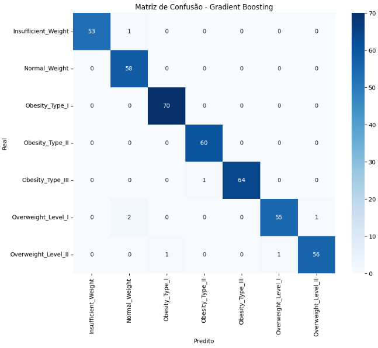
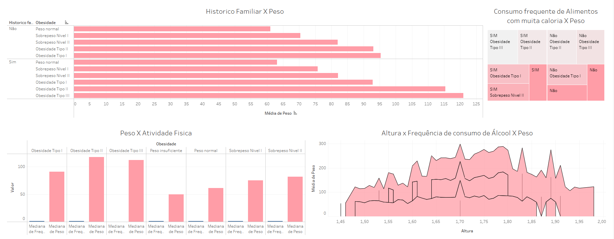

## tech-challenge-obesity

# Predição de Nível de Obesidade com Machine Learning

## 1. Contexto do Problema

Neste projeto, foi desenvolvido um sistema preditivo de Machine Learning com o objetivo de auxiliar a equipe médica na identificação do nível de obesidade de pacientes, utilizando dados físicos e comportamentais.
A obesidade é uma condição multifatorial que impacta diretamente a saúde pública, e a proposta do trabalho é oferecer suporte à tomada de decisão clínica por meio de análise preditiva e geração de insights analíticos.

## 2. Base de Dados

Foi utilizada a base Obesity.csv, composta por 2.111 registros e 17 variáveis.
Essas variáveis incluem dados físicos, como idade, peso e altura, além de hábitos alimentares, frequência de atividade física, tempo de uso de dispositivos tecnológicos e histórico familiar.

A variável alvo representa o nível de obesidade, classificado em diferentes categorias.

A distribuição das classes mostrou-se relativamente equilibrada, reduzindo risco de viés no treinamento do modelo e contribuindo para maior confiabilidade nos resultados.

## 3. Feature Engineering

Durante a etapa de preparação, foi realizado o arredondamento das variáveis de escala e criada a variável IMC, um dos principais indicadores clínicos associados à obesidade.

Em seguida, foram separadas as variáveis numéricas e categóricas, e toda a transformação foi implementada dentro de uma pipeline de Machine Learning, utilizando StandardScaler (variáveis numéricas) e (variáveis categóricas)OneHotEncoder.

Essa abordagem garante maior robustez ao modelo e evita vazamento de dados, uma vez que as transformações são aplicadas exclusivamente com base nos dados de treino.

## 4. Modelagem

Foram testados três algoritmos de classificação: Regressão Logística, Random Forest e Gradient Boosting.

Os resultados obtidos foram:

| Modelo               | Accuracy |
|----------------------|----------|
| Logistic Regression  | 90.78%   |
| Random Forest        | 97.63%   |
| Gradient Boosting   | **98.34%** |

O modelo Gradient Boosting apresentou o melhor desempenho, superando significativamente o critério mínimo de 75% estabelecido pelo desafio.

A matriz de confusão demonstrou que os poucos erros ocorreram principalmente entre classes adjacentes, o que é esperado devido à natureza progressiva dos níveis de obesidade.

## 5. Aplicação Preditiva

Após a seleção do melhor modelo, foi realizado o deploy utilizando Streamlit.

A aplicação permite inserir os dados do paciente, calcular automaticamente o IMC e gerar a previsão do nível de obesidade.

A ferramenta pode ser utilizada como apoio à triagem inicial, auxiliando profissionais de saúde na identificação de pacientes com maior risco, sem substituir o diagnóstico clínico.

Acesse o app aqui:
(https://tech-challenge-obesity-mpu2ixco4gqgl9t2qo73p5.streamlit.app/)

## 6. Dashboard Analítico

O painel analítico permite identificar padrões associados ao nível de obesidade. Observa-se que o histórico familiar está associado a maiores médias de peso nas categorias mais avançadas. Além disso, baixa atividade física e maior consumo de alimentos calóricos apresentam correlação com níveis elevados de obesidade.

### Prévia do Painel

#### Insight 1: Histórico Familiar × Peso  
Observa-se que pacientes com histórico familiar de excesso de peso apresentam médias de peso mais elevadas nas categorias de sobrepeso e obesidade.
Esse comportamento reforça a influência de fatores genéticos e familiares no desenvolvimento da condição, indicando a importância de acompanhamento preventivo em indivíduos com predisposição.

#### Insight 2: Consumo frequente de alimentos calóricos × Peso  
O consumo frequente de alimentos altamente calóricos está associado a maiores médias de peso nas categorias de obesidade.
Esse padrão evidencia a relevância de hábitos alimentares no agravamento do quadro e reforça a necessidade de orientação nutricional como estratégia preventiva.

#### Insight 3: Peso × Atividade Física  
A análise indica que menores níveis de atividade física estão relacionados a maiores médias de peso e maior concentração nas categorias de obesidade.
Esse resultado destaca a importância da prática regular de exercícios físicos como fator de proteção.

#### Insight 4: Altura × Álcool × Peso  
Observa-se variação da média de peso associada à frequência de consumo de álcool, especialmente em indivíduos com determinadas faixas de altura.
Embora o impacto seja menos expressivo que o IMC ou atividade física, o consumo frequente de álcool pode contribuir para o aumento do peso corporal.

Acesse o dashboard aqui:
https://public.tableau.com/views/Peso_17719774131180/Painel1?:language=pt-BR&:sid=&:redirect=auth&:display_count=n&:origin=viz_share_link

## 7. Estrutura do Projeto
tech-challenge-obesity/  
│
├── Obesity.csv  
├── tech_challenge_obesity.ipynb  
├── app.py  
├── modelo_obesidade.pkl  
├── requirements.txt  
├── dashboard_tableau.png  
├── matriz_de_confusao.png  
├── Tech_Obesidade.mp4. 
└── README.md  

## 8. Vídeo de Apresentação

Link do vídeo explicando estratégia e resultados:

## 9. Conclusão

O modelo preditivo desenvolvido apresentou alto desempenho, alcançando acurácia superior a 98%, demonstrando forte capacidade de identificar padrões associados aos diferentes níveis de obesidade.

A integração entre modelagem preditiva e análise exploratória permite apoiar a equipe médica na identificação de perfis de risco e na tomada de decisão baseada em dados.

Ressalta-se que a ferramenta atua como suporte adicional e não substitui avaliação clínica especializada.
